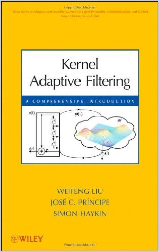

# Kernel Adaptive Filtering: A Comprehensive Introduction
  
[Weifeng Liu](http://cnel.ufl.edu/people/people.php?name=wfliu), [Jose C. Principe](http://cnel.ufl.edu/people/people.php?name=principe), Simon Haykin.  
John Wiley, 2010  

## Table of contents
1. [BACKGROUND AND PREVIEW](./samples/chapter1.pdf)  
2. [KERNEL LEAST-MEAN-SQUARE ALGORITHM](./ch2_codes)
3. [KERNEL AFFINE PROJECTION ALGORITHMS](./ch3_codes)
4. [KERNEL RECURSIVE LEAST-SQUARES ALGORITHM](./ch4_codes)
5. [EXTENDED KERNEL RECURSIVE LEAST-SQUARES](./ch5_codes)
6. [DESIGNING SPARSE KERNEL ADAPTIVE FILTERS](./ch6_codes)

## Links
* The [book](http://www.amazon.com/gp/product/0470447532?ie=UTF8&tag=weiswebsit-20&linkCode=as2&camp=1789&creative=390957&creativeASIN=0470447532) at Amazon
* A python implementation of the Kernel Adaptive Algorithm following sci-kit learn's API is being developed [here](https://github.com/EderSantana/adaptive_kernel_methods).
